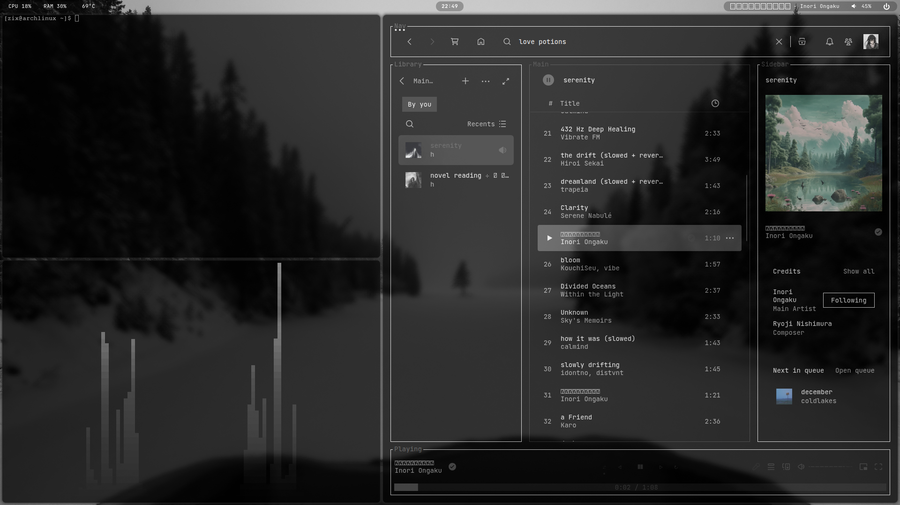

# hyprland-dotfiles

My Hyprland rice for Arch Linux: Waybar, Rofi, wlogout, hyprlock, and a
Lua-based Hyprland config (`hl.*` API, Hyprland ≥ 0.56).



## Install

Assumes: a base Arch Linux install is already done (e.g. via `archinstall`),
you can reach the network, and GPU drivers are already installed (that part
is hardware-specific — Intel/AMD/Nvidia — and out of scope for this repo).

```bash
git clone <this-repo-url> ~/hyprland-dotfiles
cd ~/hyprland-dotfiles
./install.sh
```

The script installs every package this config depends on — Hyprland itself,
SDDM (the login screen), and everything else, from official repos plus AUR
via `paru` (which it bootstraps if missing) — enables the SDDM and
NetworkManager services, then symlinks the configs into `~/.config/`
(backing up anything already there as `<file>.bak-<timestamp>`) and copies
the wallpapers into `~/Pictures/Wallpapers/`.

After it finishes: reboot (or `sudo systemctl start sddm`), pick **Hyprland**
at the login screen.

## Layout

```
hypr/                   hyprland.lua, keybinds.lua, rules.lua, hyprlock.conf, scripts/
waybar/                 config.jsonc, style.css, scripts/
rofi/                   config.rasi, colors.rasi
kitty/                  kitty.conf
wlogout/                layout, style.css, icons/
quickshell/hyprquickpaper/   wallpaper-picker shell (invoked by Super+W)
wallpapers/             ~35 images, autostart uses w3.jpg
gtk-3.0/                settings.ini, gtk.css — dark GTK theme (Thunar, file pickers)
mimeapps.list           default apps (Vivaldi for http/https)
```

Not included on purpose: `~/.config/gtk-3.0/bookmarks` (Thunar sidebar —
personal folder paths, would clobber yours) and `~/.bashrc` (stock Arch
default, nothing rice-specific in it).

## Keybinds

`mainMod` = **Super**. Workspace binds (1-9, 0) are bound by physical keycode,
not by symbol name — this matters because `kb_layout = "fr"` (AZERTY), where
the number row needs Shift to type a digit. Binding by symbol name makes
`Super+Shift+<digit>` ambiguous on that layout; physical-keycode binding
sidesteps it. If you use a different layout, this still works unchanged.

| Bind | Action |
|---|---|
| Super + T | Terminal (kitty) |
| Super + D | App launcher (rofi) |
| Super + E | File manager (thunar) |
| Super + B | Browser (vivaldi) |
| Super + Q | Close window |
| Super + Tab | Lock screen (hyprlock) |
| Super + Escape | Power menu (wlogout) |
| Super + W | Wallpaper picker (quickshell) |
| Super + F | Fullscreen |
| Super + O | Opacity picker for the rice's opacity rule |
| Super + Shift + W | Toggle waybar |
| Super + Delete | Screenshot, full screen |
| Delete | Screenshot, region select |
| Super + V | Clipboard history (cliphist + rofi) |
| Super + Z | Cycle keyboard layout |
| Super + Space | Toggle floating, centered at 70% size |
| Super + H/J/K/L or arrows | Focus left/down/up/right |
| Super + Shift + H/J/K/L or arrows | Move window left/down/up/right |
| Super + Ctrl + H/J/K/L | Resize window (repeats while held) |
| Super + [1-9,0] | Go to workspace |
| Super + Shift + [1-9,0] | Move active window to workspace |
| Super + Shift + E | Exit Hyprland |
| Media keys | Volume / mute / play-playlist-pause / next / previous |

## Notes

- **Opacity**: `hypr/rules.lua` sets a shared opacity (default 0.7) for a
  fixed app list (kitty, thunar, Discord, Spotify, etc.), plus a dedicated,
  lighter rule for Vivaldi (0.92/0.88) so page text stays readable. Super+O
  opens a picker that rewrites the shared value and reloads.
- **GPU widget**: `waybar/scripts/gpu_usage.sh` shells out to `nvtop` and
  `jq` and assumes an NVIDIA-style GPU. On different hardware, edit or drop
  the `custom/gpu` module in `waybar/config.jsonc`.
- **Fonts**: the theme expects Iosevka, CaskaydiaCove Nerd Font, and
  JetBrainsMono Nerd Font. `install.sh` installs the first two from AUR;
  JetBrainsMono Nerd Font ships in this system's base fonts already — if
  yours doesn't, grab `ttf-jetbrains-mono-nerd` too.
- **Monitors**: `hypr/hyprland.lua` hardcodes two outputs (`DP-1`,
  `HDMI-A-2`) by name and resolution. Update the `hl.monitor(...)` calls at
  the top of that file to match your own setup — run `hyprctl monitors` after
  first login to get your actual output names.
